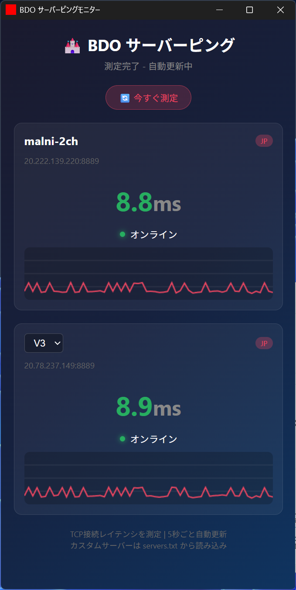

# BDO Ping Monitor

[日本語 (Japanese)](README.md) | [English](README_en.md)



An unofficial application to measure and visualize network latency (TCP ping) to specific PC Black Desert Online (BDO) servers in real-time.
It was originally created to objectively verify if specific PvP channels (like the Japanese "Marni-2ch" server) are actually experiencing lag.

> **⚠️ IMPORTANT FOR GLOBAL USERS**
> By default, the app is configured for the Japanese community. However, **you do not need to recompile the app** to change this.
> You can fully customize the servers by editing `servers.txt`. The very first line in the text file will become your "Main" server, replacing the Japanese default.

## Features
- **Real-time Monitoring:** Performs a TCP connection test approximately every 5 seconds and displays the ping history on a chart.
- **Lightweight & Portable:** Built with Rust & Tauri. It runs as a standalone `.exe` without any installation.
- **Fully Customizable Servers:** Edit `servers.txt` to set your primary and secondary servers.

## Usage (For General Users)

Download the latest `BDO-Ping-Monitor-Portable.zip` from the [Releases](../../releases) page and extract it. 
Just run `bdo-ping-monitor.exe`. No installation is required.

### Changing and Adding Servers (`servers.txt`)
You can add your region's servers by editing `servers.txt` located in the same folder as the executable.

**Rules:**
- The **first line** will be used as the **Main** server at the top of the app.
- The **second line and below** will be added to the **Sub** server dropdown at the bottom.

**Example:**
```text
# BDO Custom Server List
# Format: ServerName:IP_Address
NA-Solare: 12.34.56.78
EU-Solare: 98.76.54.32
```

### How to find your Server IP
If you don't know the IP address of your specific server/channel, you can easily find it using Windows Resource Monitor:

1. Launch Black Desert Online and log in to the specific server (channel) you want to measure.
2. Press `Windows Key`, type `resmon`, and open **Resource Monitor**.
3. Go to the **Network** tab.
4. Look for `BlackDesert64.exe` in the "Processes with Network Activity" list and check the box next to it.
5. Look at the **TCP Connections** section below. 
6. Find the connection where the **Remote Port** is exactly **`8889`**. That is definitely your current game server.
7. Copy the **Remote Address** (IP) of that connection and add it to your `servers.txt`.

## For Developers (Build from Source)

This project is built using Rust and Tauri (v2). 

### Prerequisites
- [Rust / Cargo](https://rustup.rs/) installed.
- [Tauri v2 prerequisites](https://v2.tauri.app/start/prerequisites/) (Visual Studio C++ Build Tools, etc.).

### Build Steps
1. Clone the repository.
2. Navigate to the `src-tauri` directory:
```bash
cd src-tauri
```
3. Run the release build:
```bash
cargo build --release
```
4. The executable will be generated at `src-tauri/target/release/bdo-ping-monitor.exe`.

## Disclaimer

This software is provided "As-Is" without any warranties, express or implied.
The author is not responsible for any direct or indirect damages, loss of data, PC issues, game account bans/restrictions, or any other troubles caused by using or being unable to use this software.
Use entirely at your **own risk**.

## Transparency
To avoid false positives from antivirus software and to assure users that this is not a malicious tool (such as a keylogger or account stealer), the entire source code is public.

## License
[MIT License](LICENSE)
